# The screens

Not one of these pictures is a capture. They all come from running in Python
the same steps the Z80 runs, and they are **checked byte for byte against
openMSX's VRAM**.

## What the check says

`make vram` lets the cartridge run, dumps the 16,384 bytes of VRAM at five
moments and compares them with the ones we build. The best dump comes down to
**a single differing byte**, and that byte is not a mistake:

| area | differing |
|---|---|
| colour table, `0x0000`–`0x17FF` | 0 of 6,144 |
| sprite patterns, `0x1800`–`0x1FFF` | 0 of 2,048 |
| pattern table, `0x2000`–`0x37FF` | 0 of 6,144 |
| name table, `0x3800`–`0x3AFF` | **1** of 768 |
| sprite attributes, `0x3B00`–`0x3B7F` | 0 of 128 |

That byte is `0x39A9`: the emulator has `0xF5` and we have `0xAC`. They are the
two states of the **blinking cursor**, which `0x527C` alternates every `0x8000`
turns of the counter at `0xD147`.

At other moments **eighteen** bytes differ, and they are the other thing that
moves: `0x3B08`–`0x3B17` holding the sprite attributes from `0x798F` instead of
those from `0x797F`, plus the tiles that go with them. That is **the menu's
ornament**, which `0x52C3` switches with bit 0 of `0xD144`. Any given dump lands
on one of the two frames.

The emulator also confirmed the seven VDP registers at `0x6284`, R3=`0x7F` and
R4=`0x07` included.

## The title screen

Six pieces, in this order (`0x77D6` and `0x7805`): the four compressed
background blocks, two character rectangles, the label block with the
`© KONAMI 1986` that dates the build, another two compressed blocks and the 24
bytes of sprite attributes.

Building it has an ordering trap. The RANKING mode's background is loaded
**before** the title, and its colour table appears gradually: `0x533B` fills it
with `0xF0` at 21 bytes a pass, six passes, `0x0880`–`0x0C6F` exactly. Placed at
the end, that fill eats the `0xFC` that `0x780D` leaves at `0x0980` and the
colours `0x77E4` drops at `0x0C00`: 448 bytes of difference against the
emulator.

## The three start-up pointers

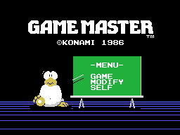

`0x4FA9`, `0x4FB5` and `0x4FC1`: twelve tiles each, three rows of four — the
`bc,0x0304` at `0x4F91` — always painted in the same place, VRAM `0x39AB`.
**Read as bytes they say nothing.** Drawn, you can see what they are: a chalk
pointer that changes its slant to aim at GAME, MODIFY or SELF on the
blackboard.

## The menus that build their own screen

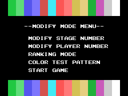
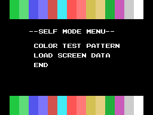
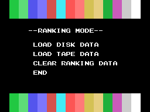
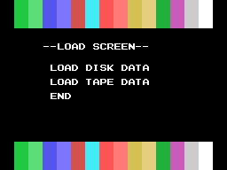
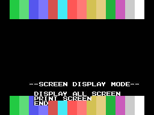

These clear `0x200` bytes from `0x3880` and paint the colour bands at top and
bottom. The bands are not a stored picture: the loop at `0x504E` writes them,
repeating each tile **twice** and advancing, with B=`0x10`, that is 32 bytes —
a whole row — per turn; since A starts at 1 and wraps with `and 0x0F`, the row
comes out `1,1,2,2,…,15,15,0,0`. The `dec c` at `0x505F` repeats it four times,
and `0x503C` does all of that twice: rows 0 to 3 and rows 20 to 23.

## The menus that open over the game

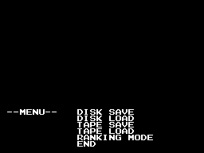
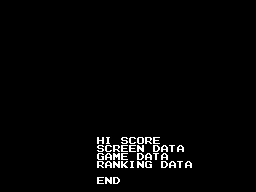
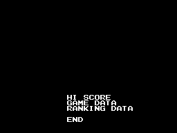
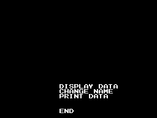
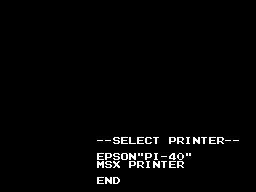

These only clear `0x100` bytes from `0x3A00`, the bottom eight rows. **On a real
machine the top half is the game still running**: `0x4275` first calls the
routine that carries the game's VRAM into RAM so it can be put back. Here they
show on black because there is no game to put.

That the load menu has no SCREEN DATA is not an oversight: it does not fit on
tape.
